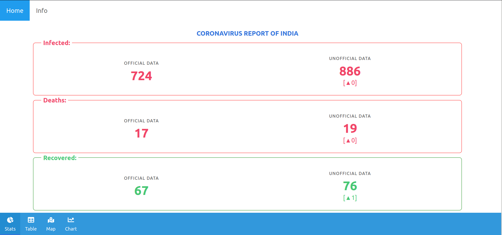

# INCOV PROJECT WEBSITE

[[LIVE WEBSITE]](https://covid19.palashbauri.in)

#### Other Parts of the Project:

- [MOHFW , India - Daily Data](https://github.com/bauripalash/ncov-19-india/tree/master/data)

- [Data Scrapper Script](https://github.com/bauripalash/incov-script)

#### How to Run:

- Make Sure you have NodeJS and Yarn Installed
- `yarn install` : To Install Dependencies
- `yarn run dev` : To Run Development Server
- `yarn run build` : To Build a Production Build

Made by , Palash Bauri
